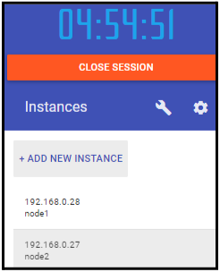
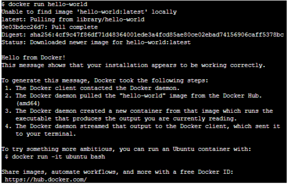

# Practice 01

## Intro con Docker labs

1. Accede a https://www.docker.com/play-with-docker
2. Visita el lab environment y crea una cuenta de docker si no la tienes ya
3. Deberias acabar en https://labs.play-with-docker.com/
4. Crea una instancia

5. Introduce el comando

    docker run hello-world

6. Introduce docker a secas como comando y obten el listado de sub-comandos, algunos se usan a menudo:

* docker volume
* docker image
* docker ps
* docker top

7. El laboratorio se mantiene varias horas, mantenlo abierto y aprovecha para ir probando comandos que comentemos en teoría como docker run ubuntu

8. Observa que este run no saca ningún texto de salida, el hello-world sí lo hacía.

9. Prueba a lanzar docker image ls y observa el listado de imágenes disponibles